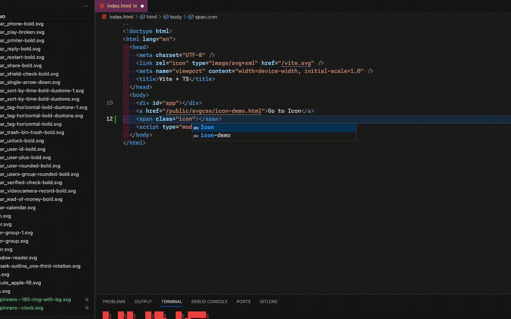

<p align="center">
<a href="https://www.npmjs.com/package/csvgtocss" target="_blank" rel="noopener noreferrer">
</a>
</p>

<p align="center">
  A script converts svg file to icons
</p>

<p align="center">
  <a href="https://www.npmjs.com/package/csvgtocss" target="_blank" rel="noopener noreferrer"></a>
  <a href="https://www.npmjs.com/package/csvgtocss" target="_blank" rel="noopener noreferrer"></a>
  <a href="https://bundlephobia.com/result?p=csvgtocss" target="_blank" rel="noopener noreferrer"></a>
  <a href="https://github.com/hunghg255/csvgtocss/graphs/contributors" target="_blank" rel="noopener noreferrer"></a>
  <a href="https://github.com/hunghg255/csvgtocss/blob/main/LICENSE" target="_blank" rel="noopener noreferrer"></a>
</p>

## Demo

[Github](https://github.com/hunghg255/csvgtocss)

[Demo](https://svg-to-css.surge.sh)

## Install

```bash
npm i csvgtocss@latest --save-dev
```

## Setup

### Create file: `svgtocss.config.{ts,js,mjs}`

```js
import { defineConfig } from 'csvgtocss';

export default defineConfig({
  src: 'svg', // svg path
  dist: 'dist', // output path
  prefix: 'csvgtocss', // font name
  exportJson: true, // export json file
});
```

## CLI (file package.json)

```
-c: Config
```

```json
{
  ...
  "scripts": {
    ...
    "csvgtocss": "csvgtocss",
  },
  ...
}
```

### Custom config file

- You can also use a custom config file instead of `svgtocss.config.{ts,js,mjs}`. Just create `<FILE_NAME>.config.{ts,js,mjs}` to build command

```js
Exp: awesome.config.ts;
```

```json
{
  ...
  "scripts": {
    ...
    "csvgtocss": "csvgtocss -c awesome",
  },
  ...
}
```

## Preview Icon

- Install [iconify-preview](https://marketplace.visualstudio.com/items?itemName=hunghg255.iconify-preview)
- Config `.vscode/settings.json` read file json icon which generate after run script

```json
{
  "iconify.color": "#ddd",
  "iconify.customCollectionJsonPaths": ["./public/svgcss/icon-collection.json"], // path json file
  "iconify.delimiters": ["-"],
  "iconify.prefixes": ["", "icon"],
  "iconify.inplace": false,
  "iconify.annotations": true,
  "iconify.languageIds": ["typescript", "typescriptreact"]
}
```



### About

<a href="https://www.buymeacoffee.com/hunghg255" target="_blank"></a>

Gia Hung – [hung.hg](https://hung.thedev.id)
