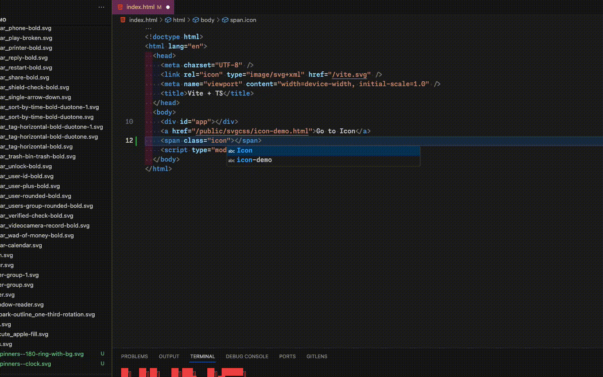

<p align="center">
<a href="https://www.npmjs.com/package/csvgtocss" target="_blank" rel="noopener noreferrer">
</a>
</p>

<p align="center">
  A script converts svg file to icons
</p>

<p align="center">
  <a href="https://www.npmjs.com/package/csvgtocss" target="_blank" rel="noopener noreferrer"></a>
  <a href="https://www.npmjs.com/package/csvgtocss" target="_blank" rel="noopener noreferrer"></a>
  <a href="https://bundlephobia.com/result?p=csvgtocss" target="_blank" rel="noopener noreferrer"></a>
  <a href="https://github.com/hunghg255/csvgtocss/graphs/contributors" target="_blank" rel="noopener noreferrer"></a>
  <a href="https://github.com/hunghg255/csvgtocss/blob/main/LICENSE" target="_blank" rel="noopener noreferrer"></a>
</p>

## Demo

- [Docs](./docs) — usage guide, how it works, and an icon browser (React site in `docs/`)
- [Demo page](https://svg-to-css.surge.sh)
- [GitHub](https://github.com/hunghg255/csvgtocss)

csvgtocss turns a folder of SVG files into **one CSS file**. Every icon becomes a class such as `.icon-add` that you put on any element — no icon font, no JavaScript runtime, no sprite.

- **Monochrome icons** follow the text `color` (rendered with a CSS mask + `currentColor`).
- **Multicolor icons** keep their original colors (rendered as a background image).
- Icons are `1em` × `1em`, so they are sized with `font-size` and line up with text.
- A TypeScript union type of all icon names and a preview page are generated too.

## Install

```bash
npm i csvgtocss@latest --save-dev
```

## Setup

### 1. Put your SVG files in a folder

The file name becomes the class name, lower-cased and kebab-cased: `ArrowLeft.svg` → `.icon-arrowleft`, `ic_close.svg` → `.icon-ic-close`. Subfolders are included, but the folder name is not part of the class name, so file names must be unique.

### 2. Create file: `svgtocss.config.{ts,js,mjs}`

```js
import { defineConfig } from 'csvgtocss';

export default defineConfig({
  src: 'svg', // folder with your .svg files
  dist: 'dist', // output folder (emptied on every run!)
  prefix: 'icon', // class prefix -> .icon-add
  exportJson: true, // also write an Iconify JSON collection
});
```

| Option       | Type    | Default  | Description                                                          |
| ------------ | ------- | -------- | -------------------------------------------------------------------- |
| `src`        | string  | —        | Folder with the SVG files, relative to the working directory.        |
| `dist`       | string  | —        | Output folder. **It is emptied before files are written.**           |
| `prefix`     | string  | `'icon'` | Class prefix and file name prefix: `.prefix-name`, `prefix-css.css`. |
| `exportJson` | boolean | `false`  | Also write `prefix-collection.json` (Iconify format).                |

### 3. CLI (file package.json)

```
-c: Config
```

```json
{
  ...
  "scripts": {
    ...
    "csvgtocss": "csvgtocss",
  },
  ...
}
```

### Custom config file

- You can also use a custom config file instead of `svgtocss.config.{ts,js,mjs}`. Just create `<FILE_NAME>.config.{ts,js,mjs}` and pass `<FILE_NAME>` to the command

```js
Exp: awesome.config.ts;
```

```json
{
  ...
  "scripts": {
    ...
    "csvgtocss": "csvgtocss -c awesome",
  },
  ...
}
```

### Programmatic use

```js
import { svg2Font } from 'csvgtocss';

await svg2Font({ src: 'svg', dist: 'src/icons', prefix: 'icon' });
```

## Output

With `prefix: 'icon'`, one run writes:

| File                   | Description                                                                      |
| ---------------------- | -------------------------------------------------------------------------------- |
| `icon-css.css`         | All icon classes, each SVG embedded as a data URI. The only file your app needs. |
| `icon-type.d.ts`       | `Ticon`, a union type of every class name.                                       |
| `icon-demo.html`       | Preview page with search, filter, size and color controls.                       |
| `icon-collection.json` | Iconify JSON collection (only with `exportJson: true`).                          |

## Usage

### HTML

```html
<link rel="stylesheet" href="dist/icon-css.css" />

<!-- inherits size and color from the surrounding text -->
<button><i class="icon-add"></i> Add item</button>

<!-- size with font-size, color with color (monochrome icons) -->
<i class="icon-add" style="font-size: 32px; color: #4f46e5"></i>

<!-- accessibility: hide decorative icons, label meaningful ones -->
<i class="icon-add" aria-hidden="true"></i>
<i class="icon-add" role="img" aria-label="Add"></i>
```

### React

No runtime package is needed: import the CSS once and use the generated type.

```tsx
import type { HTMLAttributes } from 'react';
import './icons/icon-css.css';
import type { Ticon } from './icons/icon-type';

type IconProps = HTMLAttributes<HTMLElement> & { name: Ticon };

export function Icon({ name, className, ...rest }: IconProps) {
  return (
    <i
      className={className ? `${name} ${className}` : name}
      aria-hidden={rest['aria-label'] ? undefined : true}
      {...rest}
    />
  );
}

// <Icon name="icon-add" style={{ fontSize: 24, color: 'tomato' }} />
```

## How it works

Everything happens at build time with [@iconify/tools](https://iconify.design/docs/libraries/tools/):

1. **Import** every `.svg` in `src`.
2. **Clean up**: validate the markup, strip editor metadata, turn `<style>` rules into attributes.
3. **Classify**: count the visible fill and stroke colors. One color (opacity differences allowed) = monochrome; two or more colors, a gradient, a pattern or a bitmap = multicolor.
4. **Recolor** monochrome icons: every color becomes `currentColor`.
5. **Optimize** with SVGO.
6. **Emit CSS**: each SVG becomes a data URI in a class rule.

Monochrome icons use a CSS mask. The element is a `1em` box filled with `background-color: currentColor`, and the SVG is the mask that cuts out the shape, so the icon takes the `color` of its parent just like text:

```css
.icon-add, .icon-fit /* , ... */ {
  display: inline-block;
  width: 1em;
  height: 1em;
  background-color: currentColor;
  -webkit-mask-image: var(--svg);
  mask-image: var(--svg);
  -webkit-mask-repeat: no-repeat;
  mask-repeat: no-repeat;
  -webkit-mask-size: 100% 100%;
  mask-size: 100% 100%;
}

.icon-add {
  --svg: url("data:image/svg+xml,...");
}
```

Multicolor icons use the same shared rule with `background-image` instead, so their palette is kept.

### Why CSS icons?

| Approach                      | Multicolor | Color via CSS | Cost in JS bundle | Requests   |
| ----------------------------- | ---------- | ------------- | ----------------- | ---------- |
| **CSS classes (csvgtocss)**   | Yes        | Mono icons    | None              | 1 CSS file |
| Icon font                     | No         | Yes           | None              | Font files |
| Inline SVG / React components | Yes        | Yes           | Every icon        | None       |
| ``        | Yes        | No            | None              | 1 per icon |
| SVG sprite + `<use>`          | Yes        | Yes           | None              | 1 sprite   |

- **Zero JavaScript**: icons add nothing to your bundle or hydration, and work in any framework or plain HTML.
- **One cacheable file** bundled with the rest of your CSS.
- **Behaves like text**: `1em` sizing and `currentColor`.
- **No icon-font artifacts**: no glyph hinting, baseline quirks or flash of empty squares.

Trade-offs: the whole set is in the CSS even if a page uses a few icons (keep sets focused or split them by prefix), single paths cannot be styled or animated, multicolor icons cannot be recolored, and browsers skip backgrounds when printing unless `print-color-adjust: exact` is set.

### Troubleshooting

- **An icon is missing**: icons that fail to parse are skipped and the CLI prints `Generate icon ERROR`. A common cause is SVGs from Figma/Illustrator with `clip-path="url(#clip0_...)"` that points to a `<clipPath>` that does not exist. Remove the attribute or re-export the icon. SVGs with `<script>` are rejected too.
- **A one-color icon does not follow `color`**: it was classified as multicolor. Look for a leftover background rectangle, a gradient, or two slightly different shades, and remove them.

## Preview Icon

- Install [iconify-preview](https://marketplace.visualstudio.com/items?itemName=hunghg255.iconify-preview)
- Config `.vscode/settings.json` read file json icon which generate after run script

```json
{
  "iconify.color": "#ddd",
  "iconify.customCollectionJsonPaths": ["./public/svgcss/icon-collection.json"], // path json file
  "iconify.delimiters": ["-"],
  "iconify.prefixes": ["", "icon"],
  "iconify.inplace": false,
  "iconify.annotations": true,
  "iconify.languageIds": ["typescript", "typescriptreact"]
}
```



## Development

```bash
pnpm install
pnpm build   # build the library (unbuild)
pnpm lint    # oxlint

# docs site (React + Vite), needs the library build above
cd docs && pnpm install && pnpm dev
```

### About

<a href="https://www.buymeacoffee.com/hunghg255" target="_blank"></a>

Gia Hung – [hung.hg](https://hung.thedev.id)
